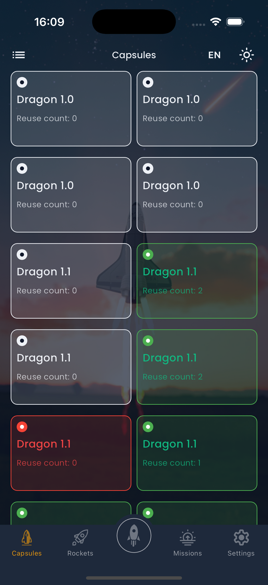
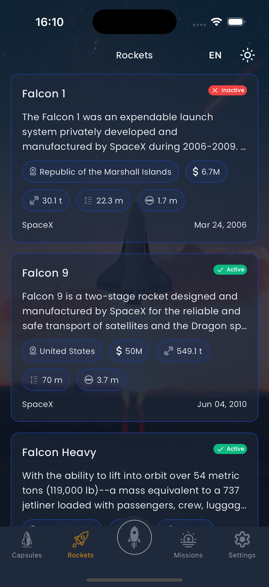

# 🚀 SpaceX Flutter App - UI/UX Development Challenge

A Flutter application development challenge focused on creating a beautiful UI/UX experience for exploring SpaceX data. This project serves as a base structure for applicants to implement and showcase their Flutter development skills.

## 📋 Table of Contents

- [Challenge Overview](#challenge-overview)
- [Project Setup](#project-setup)
- [Architecture](#architecture)
- [Development Tasks](#development-tasks)
- [SpaceX API Integration](#spacex-api-integration)
- [Design System](#design-system)
- [Evaluation Criteria](#evaluation-criteria)
- [Submission Guidelines](#submission-guidelines)
- [Screenshots](#sscreenshots)

## 🎯 Challenge Overview

This repository contains a base Flutter project structure that applicants need to **fork** and complete. The goal is to build a modern, responsive SpaceX data explorer app with exceptional UI/UX design.

### What You'll Build

- A SpaceX capsule and rocket explorer app
- Beautiful, space-themed UI with smooth animations
- GraphQL integration with SpaceX API
- Clean architecture implementation
- Responsive design for all screen sizes

## 🚀 Project Setup

### Prerequisites

- Flutter SDK (3.0+)
- Dart SDK (3.16+)
- Android Studio / VS Code
- Git

## 📦 Installation Guide

### System Requirements

#### Minimum Requirements
- **Operating System**: Windows 10/11, macOS 10.14+, or Ubuntu 18.04+
- **RAM**: 8GB (16GB recommended)
- **Storage**: 10GB free space
- **Internet**: Stable connection for API calls and package downloads

#### Required Software

##### 1. Flutter SDK Installation

**Windows:**
```bash
# Download Flutter SDK from https://flutter.dev/docs/get-started/install/windows
# Extract to C:\flutter
# Add C:\flutter\bin to PATH environment variable

# Verify installation
flutter doctor
```

**macOS:**
```bash
# Using Homebrew (recommended)
brew install flutter

# Or download from https://flutter.dev/docs/get-started/install/macos
# Extract and add to PATH

# Verify installation
flutter doctor
```

**Linux:**
```bash
# Download Flutter SDK
wget https://storage.googleapis.com/flutter_infra_release/releases/stable/linux/flutter_linux_3.16.0-stable.tar.xz

# Extract and add to PATH
tar xf flutter_linux_3.16.0-stable.tar.xz
export PATH="$PATH:`pwd`/flutter/bin"

# Verify installation
flutter doctor
```

##### 2. Development Environment Setup

**Android Studio (Recommended):**
1. Download from [developer.android.com](https://developer.android.com/studio)
2. Install Android SDK (API level 30+)
3. Install Flutter and Dart plugins
4. Configure Android emulator

**VS Code (Alternative):**
1. Download from [code.visualstudio.com](https://code.visualstudio.com/)
2. Install Flutter extension
3. Install Dart extension

##### 3. Additional Tools

**Git:**
```bash
# Windows (using Chocolatey)
choco install git

# macOS (using Homebrew)
brew install git

# Linux (Ubuntu/Debian)
sudo apt-get install git
```

**Chrome (for web development):**
- Download from [google.com/chrome](https://www.google.com/chrome/)

### Platform-Specific Setup

#### Android Development
```bash
# Accept Android licenses
flutter doctor --android-licenses
```

#### iOS Development (macOS only)
```bash
# Install Xcode from App Store
# Install CocoaPods
sudo gem install cocoapods
```


### Verification Steps

Run the following commands to verify your setup:

```bash
# Check Flutter installation
flutter doctor -v

# Check available devices
flutter devices

# Check Flutter version
flutter --version
```

### Getting Started

1. **Fork this repository** (do not clone)
2. Clone your forked repository:

   ```bash
   git clone https://github.com/YOUR_USERNAME/flutter_ui_ux_test_project.git
   cd flutter_ui_ux_test_project
   ```

3. Install dependencies:

   ```bash
   flutter pub get
   ```

4. Run the project:
   ```bash
   flutter run
   ```

## 🏗️ Architecture

The project follows Clean Architecture principles. You'll need to implement:

```
lib/
├── core/                    # Core utilities and configurations
│   ├── network/            # GraphQL client setup
│   ├── utils/              # Theme, colors, constants
│   └── constants/          # App constants
├── data/                   # Data layer (TO IMPLEMENT)
│   ├── models/             # Data models for SpaceX data
│   ├── queries/            # GraphQL queries
│   └── repositories/       # Data repositories
├── domain/                 # Domain layer (TO IMPLEMENT)
│   ├── entities/           # Business entities
│   ├── repositories/       # Repository interfaces
│   └── use_cases/          # Business logic
└── presentation/           # Presentation layer (TO IMPLEMENT)
    ├── providers/          # State management
    ├── screens/            # UI screens
    ├── widgets/            # Reusable widgets
    └── utils/              # UI utilities
```

## 📝 Development Tasks

### Phase 1: Foundation (Required)

- [x] **Task 1.1**: Implement data models for SpaceX entities (Capsule, Rocket, Launch, etc.)
- [x] **Task 1.2**: Create GraphQL queries for SpaceX API
- [x] **Task 1.3**: Set up repository pattern and use cases
- [x] **Task 1.4**: Implement Provider state management
- [x] **Task 1.5**: Create basic navigation structure
- [x] **Task 1.6**: Internationalization (i18n) support (English & French) - ✅ **COMPLETED**

### Phase 2: Core Features (Required)

- [x] **Task 2.1**: Build Capsule Explorer screen with list/grid view
- [x] **Task 2.2**: Create Rocket Gallery with detailed specifications
- [x] **Task 2.3**: Implement Launch Tracker for upcoming/past launches
- [x] **Task 2.4**: Add search and filter functionality
- [x] **Task 2.5**: Implement pull-to-refresh and pagination

### Phase 3: UI/UX Excellence (Required)

- [x] **Task 3.1**: Design and implement space-themed UI components
- [x] **Task 3.2**: Add smooth animations and transitions
- [x] **Task 3.3**: Implement dark/light theme switching
- [x] **Task 3.4**: Create responsive design for tablets and phones
- [x] **Task 3.5**: Add loading states and error handling

### Phase 4: Advanced Features (Bonus)

- [x] **Task 4.1**: Implement offline data caching
- [ ] **Task 4.2**: Add image gallery with zoom functionality
- [ ] **Task 4.3**: Create interactive rocket 3D models (if possible)
- [ ] **Task 4.4**: Implement push notifications for upcoming launches
- [ ] **Task 4.5**: Add accessibility features and screen reader support

## 🛰️ SpaceX API Integration

### GraphQL Endpoint

```
https://spacex-production.up.railway.app/
```

### Key Data to Implement

- **Capsules**: `capsules` query
- **Rockets**: `rockets` query
- **Launches**: `launches` query
- **Launchpads**: `launchpads` query
- **Landpads**: `landpads` query

### Sample Queries

```graphql
# Get all capsules
query GetCapsules {
  capsules {
    id
    type
    status
    serial
    reuse_count
    water_landings
    land_landings
    last_update
    launches {
      id
      name
    }
  }
}

# Get all rockets
query GetRockets {
  rockets {
    id
    name
    type
    active
    cost_per_launch
    success_rate_pct
    first_flight
    country
    company
    height {
      meters
      feet
    }
    diameter {
      meters
      feet
    }
    mass {
      kg
      lb
    }
    flickr_images
    description
  }
}
```

## 🎨 Design System

### Colors

- **Primary**: #1E3A8A (Space Blue)
- **Secondary**: #F59E0B (Rocket Orange)
- **Success**: #10B981 (Mission Green)
- **Error**: #EF4444 (Launch Red)
- **Background**: #0F172A (Dark Space)
- **Surface**: #1E293B (Card Surface)
- **Accent**: #8B5CF6 (Purple Accent)

### Typography

- **Headline**: 24sp, Bold
- **Title**: 20sp, Medium
- **Body**: 16sp, Regular
- **Caption**: 12sp, Regular

### Spacing

- **XS**: 4dp
- **S**: 8dp
- **M**: 16dp
- **L**: 24dp
- **XL**: 32dp

## 📊 Evaluation Criteria

### Technical Implementation (40%)

- Clean architecture implementation
- Proper state management
- GraphQL integration
- Code quality and organization
- Error handling

### UI/UX Design (40%)

- Visual design quality
- User experience flow
- Responsive design
- Animations and transitions
- Accessibility

### Code Quality (20%)

- Code readability
- Documentation
- Git commit history
- Performance optimization
- Testing (if applicable)

## 📤 Submission Guidelines

### What to Submit

1. **Forked Repository**: Your completed implementation
2. **Screenshots**: Key screens and features
3. **Demo Video**: 2-3 minute walkthrough (optional but recommended)
4. **README Update**: Document your implementation approach

### Submission Checklist

- [x] All required tasks completed
- [x] App runs without errors
- [x] Responsive design implemented
- [x] Clean, well-documented code
- [x] Updated README with implementation details
- [x] Screenshots included in repository

### How to Submit

1. Complete all tasks in your forked repository
2. Update the README with your implementation details
3. Add screenshots to a `screenshots/` folder
4. Create a pull request to the original repository
5. Include a brief description of your implementation approach

## 🛠️ Tech Stack

- **Framework**: Flutter 3.x
- **State Management**: Provider
- **Navigation**: GetX
- **API**: GraphQL with graphql_flutter
- **Local Storage**: SharedPreferences
- **UI Components**: Custom widgets + Material Design
- **Internationalization**: Custom i18n implementation (English & French)

## 📚 Learning Resources

### Flutter

- [Flutter Documentation](https://flutter.dev/docs)
- [Flutter Widget Catalog](https://flutter.dev/docs/development/ui/widgets)
- [Material Design Guidelines](https://material.io/design)

### State Management

- [Provider Package](https://pub.dev/packages/provider)
- [GetX Package](https://pub.dev/packages/get)

### GraphQL

- [GraphQL Flutter](https://pub.dev/packages/graphql_flutter)
- [GraphQL Documentation](https://graphql.org/learn/)

## Screenshots
<p align="left">
  
  
  
  
  
  
  
  
  
  
  
</p>